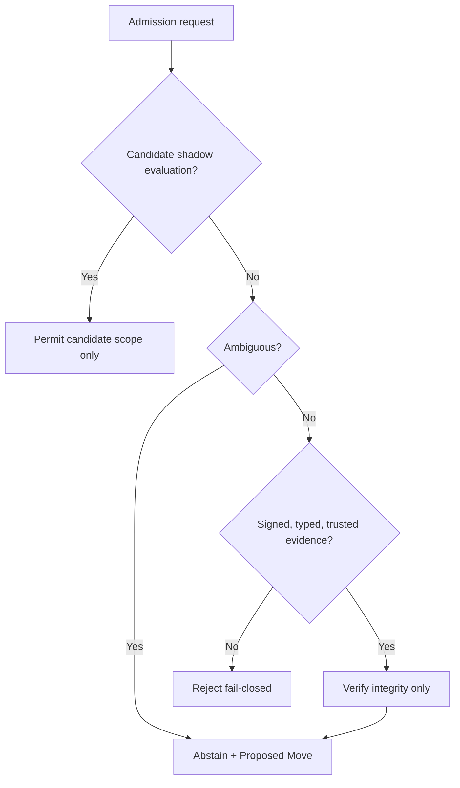

# Cloudflare candidate admission boundary

This adapter is a **candidate-only, safe-off Cloudflare Worker projection** for
Quirk Core PR #1. It can model and test admission requests. It cannot approve,
canonize, activate, release, route, retain, persist, or deploy anything.

The hard invariant is deliberately stronger than signature verification:

> Signed evidence can prove integrity. It does not create authority.

Even a valid Ed25519 envelope covering all twelve declared admission gates
returns `abstain`, `authority_granted: false`, and a typed `ProposedMove`. An
authoritative admission system outside this adapter must resolve that move.

## Architecture



The adapter keeps three products separate:

| Product | Owner/source | What this directory does |
| --- | --- | --- |
| Canonical definition | Quirk Core canon after admission | References `subject_ref` and `subject_digest`; never redefines canon. |
| Runtime enforcement | This Worker candidate | Rejects or abstains; never grants authority or operational effects. |
| Runtime/database projection | A separately admitted implementation | Not present. No KV, D1, R2, Queue, Hyperdrive, Supabase, or service binding exists. |

## Boundary behavior

`POST /v1/admission-boundary/evaluate` accepts at most 65,536 bytes of UTF-8
JSON. The request must identify a candidate subject, its SHA-256 digest, the
requested target status, and whether resolution is determinate.

- `Candidate` + `shadow_evaluate` returns `permit_candidate_scope`; the response
  still sets `authority_granted: false` and `operational_effects_permitted: false`.
- `Approved`, `Canonical`, `Live`, `Current`, `Active`, `Chooseable`, and
  `Useable` require a typed, signed admission envelope.
- Missing, malformed, untrusted, expired, mismatched, incomplete, or invalidly
  signed evidence is rejected with HTTP 403.
- `ambiguous`, `unknown`, `conflicting`, or `novel` resolution always abstains
  and emits a typed candidate `ProposedMove`.
- Fully valid evidence is integrity-verified, then still abstains and emits a
  `ProposedMove` for the authoritative admission contract.

The signed payload is transported as base64url-encoded UTF-8 JSON. The exact
bytes are hashed and signed, avoiding ambiguous JSON canonicalization. The
runtime validator requires:

1. The typed admission decision matches the request subject, digest, and target.
2. The decision is within its declared validity window.
3. All twelve manifest gates appear exactly once, pass, cite evidence, and name
   a deciding authority.
4. The Ed25519 signature verifies against a separately supplied public trust
   root.

## Safe-off Worker example

The deployable entrypoint intentionally passes an empty trust store. It can
exercise candidate scope and demonstrate fail-closed behavior, but it cannot
accept any signer. Tests inject ephemeral public keys directly into the pure
validator. No private key, API token, secret, account identifier, route, or
Cloudflare resource binding is needed or included.

`wrangler.jsonc` is a local configuration example, not deployment evidence. It
sets the current compatibility date, uses the ES module Worker entrypoint,
enables `nodejs_compat`, disables `workers.dev`, and enables structured log and
trace collection if somebody later performs an independently authorized
deployment. This change does not do that.

## Local verification

Requires Node.js 22 or newer.

```sh
npm install --ignore-scripts
npm run check
```

The tests run locally in the Workers runtime using Cloudflare's Vitest
integration. They generate ephemeral Ed25519 key pairs and require no account,
network call, token, or secret. Covered failure modes include absent evidence,
unknown trust roots, tampered signatures, missing admission gates, subject
mismatch, ambiguity, oversized bodies, and the critical control: valid evidence
still cannot promote a candidate.

## Threat model and remaining risks

- **Trust-root governance is intentionally unresolved.** Wiring a key registry,
  service binding, Secrets Store key, or external policy engine is a separate
  Proposed Move. This adapter must not choose its own granting authority.
- **No replay registry exists.** Validity windows limit exposure, but decision ID
  replay and revision monotonicity require an authoritative append-only store.
- **No revocation feed exists.** A once-trusted key may later be revoked; the
  authoritative admission service must resolve key state at decision time.
- **No persistence means no Proposed Move is actually queued.** The Worker emits
  a typed candidate move in its response. Durable routing belongs to an admitted
  Queue, Workflow, or service binding design.
- **Schema equivalence is not claimed.** The repository's v0.2 candidate now
  executes the 22 adversarial fixtures, three cross-cutting fixtures, and eleven
  positive controls. This Worker enforces a separate transport boundary; its
  tests neither replace that proof nor admit either contract.
- **Logs are evidence aids, not decisions.** The Worker logs only decision
  metadata and blocker codes, never signed payloads or signatures. Log retention
  cannot substitute for a Quirk decision ledger.

## Current Cloudflare basis

The example follows Cloudflare's current guidance as verified on 2026-08-11:

- [Workers best practices](https://developers.cloudflare.com/workers/best-practices/workers-best-practices/)
- [Wrangler configuration](https://developers.cloudflare.com/workers/wrangler/configuration/)
- [TypeScript Workers](https://developers.cloudflare.com/workers/languages/typescript/)
- [Workers Vitest integration](https://developers.cloudflare.com/workers/testing/vitest-integration/)
- [Web Crypto algorithms](https://developers.cloudflare.com/workers/runtime-apis/web-crypto/#supported-algorithms)
- [Workers Logs](https://developers.cloudflare.com/workers/observability/logs/workers-logs/)

Cloudflare currently recommends `wrangler.jsonc` for new Workers, a current
`compatibility_date`, generated/config-aligned types, structured observability,
bounded body handling, Web Crypto for security operations, and the Workers
Vitest integration for local tests. Ed25519 sign, verify, import, and export are
listed as supported Worker Web Crypto operations.
