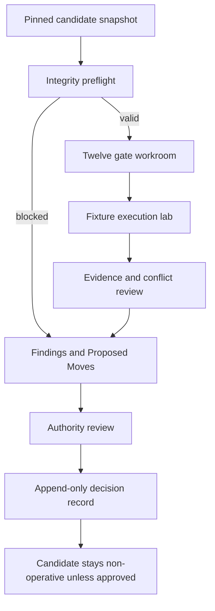

# Quirk Admission Console Flow Specification

**Status:** Candidate product specification  
**Subject:** `doctrine.classification.anti_limiting@0.1.0`  
**Current outcome:** **REVISE**; candidate remains non-operative  
**Scope:** Review flow only. This is not a screenshot audit, visual design, UI
build, or claim of WCAG conformance.

## Product intent

The Admission Console lets a reviewer determine whether a candidate has earned
operational authority without allowing the review surface to grant that
authority itself. It must make missing proof more visible than polished prose,
preserve exact candidate and evidence versions, and turn unresolved work into
typed Proposed Moves.

The primary user outcome is a reproducible decision pack another authorized
operator can inspect without access to Bryan's private context.

## Non-negotiable interaction rules

1. A candidate is always labeled **Candidate · no runtime authority** until an
   authorized admission record says otherwise.
2. The source commit, candidate version, manifest digest, schema digest, and
   evaluation-suite digest stay pinned throughout a review.
3. Gate completion, fixture execution, evaluator recommendation, and authority
   decision are distinct records. The console never collapses them into one
   progress score.
4. A provider name, file link, checkmark, or successful upload is not proof by
   itself. Evidence must resolve, identify its issuer and subject, and carry a
   digest or other immutable integrity reference.
5. Missing, stale, conflicting, or indeterminate proof fails closed. It never
   becomes a soft pass.
6. Capability to edit, execute, recommend, or deploy does not imply authority
   to admit the candidate or grant an exception.
7. The outcome vocabulary exposed for this review is `approve`, `revise`,
   `reject`, or `supersede`. The manifest's extra `defer` value is displayed as
   a contract finding, not offered as a fifth decision.

## Actors and authority separation

| Role | May do | Must not imply |
| --- | --- | --- |
| Proposer / owner | Explain intent, answer findings, submit revisions | Gate pass or admission authority |
| Gate evaluator | Run a named procedure and issue a scoped result | Authority outside that gate |
| Evidence issuer | Produce a versioned artifact or observation | That the evidence is sufficient |
| Review lead | Assemble findings and recommend an outcome | Final admission unless separately authorized |
| Decision authority | Record one allowed outcome for the pinned subject | That authorship, ownership, or technical capability granted authority |
| Runtime operator | Consume an admitted decision | Permission to reinterpret or repair the decision silently |

The console shows principals, capabilities, and authority references separately.
Potential role overlap is a visible conflict requiring an explicit policy
decision; the interface does not infer that overlap is acceptable or forbidden.
The component that changes candidate status must verify a decision record from
the declared authority rather than trust the console session.

## Review flow

### 1. Pinned candidate snapshot

The entry view shows the candidate title, ID, version, PR and commit reference,
scope, owner, current status, runtime authority, enforcement mode, supersession
lineage, and all four pinned digests. The status banner remains in view on every
review step.

Primary action: **Start evidence preflight**. There is no **Approve** shortcut.

### 2. Integrity preflight

Preflight checks that the manifest, schema, and evaluation suite parse; identify
the same subject and compatible versions; preserve all eleven source statements
and hashes; and resolve every referenced contract. A changed digest suspends the
review and offers **Fork review for new revision**, never silent continuation.

The interface distinguishes:

- **Artifact valid:** the file satisfies its structural contract.
- **Evidence verified:** the evidence resolves and matches its declared subject.
- **Claim proved:** the verified evidence satisfies a named criterion.

Those states must not share a single generic `valid` badge.

### 3. Twelve gate workroom

Show the twelve required gates from the manifest, without hiding the last three
behind the nine-gate doctrine table:

1. Quirk Approval
2. Procedures
3. Processes
4. Profiling
5. Interoperability
6. Security
7. Statistical
8. Lexical
9. Quirk Pedantry
10. Ship It Without Bryan
11. Separation of Authority
12. Migration and Rollback

Each gate has one state: `not_started`, `running`, `pass`, `fail`, `blocked`,
`not_applicable_pending_authority`, or `not_applicable_authorized`. There is no
untyped waiver. A gate can become `not_applicable_authorized` only through a
versioned applicability decision with evidence and authority; until then it
blocks approval.

Opening a gate reveals its criterion-by-criterion result, evaluator and
authority references, procedure version, candidate digest, evidence references,
timestamps, confidence, blockers, staleness rule, and superseded result. A gate
pass never changes candidate status by itself.

### 4. Fixture execution lab

The suite view groups the 22 fixtures by the eleven rule IDs and shows both
cases per rule. Before **Run fixtures** becomes available, the console verifies:

- every adapter resolves to an executable, versioned contract;
- every fixture validates against its adapter input schema;
- expected result, disposition, and finding codes are declared;
- positive controls and near-miss boundary cases exist so a reject-everything
  implementation cannot pass;
- the runner can emit immutable, case-level evidence.

Current fixture declarations do not satisfy that execution preflight: they
name adapters and expected failures but provide no executable adapter or run
evidence. They may be inspected, but must display **Declared · not executed**.

Case states are `not_run`, `running`, `fixture_pass`, `fixture_fail`,
`indeterminate`, or `infrastructure_error`. An expected rejection counts as a
fixture pass only when the observed result, disposition, and required finding
codes match. Generic rejection, missing findings, or runner failure cannot
masquerade as doctrinal proof.

The result drawer contains the input digest, runner and adapter versions,
expected-versus-observed fields, evidence references, logs with secrets
redacted, duration, retry lineage, and any Proposed Move created from the case.

### 5. Findings and Proposed Moves

Every failed criterion, conflict, or missing proof becomes a typed Finding.
The reviewer may group related findings for presentation, but each source link
remains independently traceable.

An unresolved blocking Finding can create a Proposed Move containing:

- stable move ID, candidate reference, and candidate digest;
- triggering gate, fixture, finding, or contract contradiction;
- requested change and deliberately narrow scope;
- minimum proof required to close it;
- accountable owner and queue;
- required granting-authority reference;
- provenance, dependencies, current state, and supersession lineage.

A Proposed Move proposes work. Creating, assigning, accepting, or completing it
cannot admit the candidate, grant an exception, or alter runtime behavior. It
closes only after its proof is verified against the pinned revision or is
explicitly superseded.

### 6. Authority review and decision

The decision view presents, in this order:

1. Subject and immutable revision.
2. Four-outcome control with the evaluator's recommendation kept separate.
3. Twelve-gate matrix and fixture-execution summary.
4. Blocking findings, contradictions, missing proof, and confidence basis.
5. Minimum changes required before reconsideration.
6. Authority identity, authority policy, conflicts, and acknowledgement.
7. Append-only preview of the decision record.

**Approve** is disabled unless every required or authoritatively inapplicable
gate is resolved, every required fixture has executable proof, no admission
blocker remains, and separation-of-authority validation passes. The interface
names every unmet condition beside the disabled action.

For the current review, the explicit outcome is **REVISE** because no complete
twelve-gate evidence set or executable 22-fixture run proves admission. The
result preserves candidate status and zero operational authority, records the
blockers and confidence, and opens the minimum Proposed Moves. A revision starts
a new pinned review; compatible evidence may be referenced but never silently
carried forward.

## Current REVISE presentation

The console's decision summary should say:

> **REVISE · Canon admission blocked.** The doctrine remains a candidate in
> shadow-only evaluation. The 22 cases are declared but not proven executable,
> and the twelve required gates lack a complete set of scoped, authorized pass
> records. Implement the runner and adapter contracts, add anti-gaming controls,
> resolve schema and manifest contradictions, and attach gate evidence before
> requesting admission again.

The summary includes confidence and its basis, not a decorative percentage.
It links to each blocker and required proof. It never labels a fixture
declaration, document presence, or partial gate count as completion.

## Accessibility contract

Target WCAG 2.2 AA and verify it in implementation; this specification alone
does not establish conformance.

- Use semantic headings, landmarks, tables, fieldsets, labels, and a logical
  reading order. Provide a card/list alternative when a wide matrix cannot
  reflow without two-dimensional scrolling.
- Expose status with text and programmatic names, never color alone. Keep
  `blocked`, `failed`, `not run`, and `not applicable pending authority`
  linguistically distinct.
- Make the entire flow keyboard operable with visible focus, a skip link, and
  focus moved to the error summary or decision confirmation after submission.
- Announce run start, completion, interruption, and result counts through a
  restrained live region. Do not announce streaming logs line by line.
- Tie validation messages to their fields, preserve entered work after errors,
  and provide error-summary links to each problem.
- Use at least 4.5:1 text contrast and 3:1 component/focus contrast; design for
  200% zoom, 400% text reflow, reduced motion, and 44-by-44 CSS pixel primary
  targets where layout permits.
- Require explicit confirmation for a decision record. Do not use countdowns,
  auto-advance, hover-only evidence, drag-only ordering, or ambiguous icon-only
  controls.

## Failure states and safe behavior

| Failure | User-facing behavior | Safe system effect |
| --- | --- | --- |
| Parse, schema, or digest failure | Name artifact, location, expected contract, and retry path | Stop review; preserve candidate status |
| Missing adapter or fixture contract | Mark cases `Declared · not executed`; link exact dependency | Disable execution and approval |
| Partial or interrupted run | Preserve completed case evidence; mark remainder `not_run` or `infrastructure_error` | Never calculate a full-suite pass |
| Expected and observed findings differ | Show a field-level diff and raw evidence reference | Mark fixture fail or indeterminate |
| Missing, stale, or unresolved gate evidence | Name criterion and required replacement proof | Gate remains blocked; no soft pass |
| Candidate digest changes mid-review | Show old and new digests with semantic-diff link | Suspend review; fork a new revision |
| Authority conflict or self-admission attempt | Identify conflicting roles and policy reference needed | Block decision recording |
| Persistence conflict | Preserve local draft and show authoritative latest record | Never overwrite append-only history |
| Proposed Move creation fails | Keep the Finding visible with a retryable draft payload | Do not resume unsafe runtime behavior |
| Connector or evidence provider unavailable | Show last verified timestamp and unresolved evidence state | Provider availability never becomes proof |
| Permission denied | Explain required capability and authority separately | Do not broaden permissions or retry as another principal |

## Product acceptance checks

- A reviewer cannot mistake candidate, gate-pass, recommended, approved, and
  canonical states for one another.
- A reject-everything validator cannot earn a passing fixture summary.
- Approval remains impossible with one missing gate, indeterminate fixture,
  unresolved blocker, changed digest, or authority conflict.
- Revising, rejecting, or superseding preserves an append-only decision record
  and predecessor lineage.
- A Proposed Move cannot execute the change it proposes or grant its own
  authority.
- A keyboard and screen-reader user can identify the current step, inspect all
  evidence, recover from errors, and record an authorized outcome.
- Another qualified operator can reproduce the decision from visible records
  without private conversation memory.
